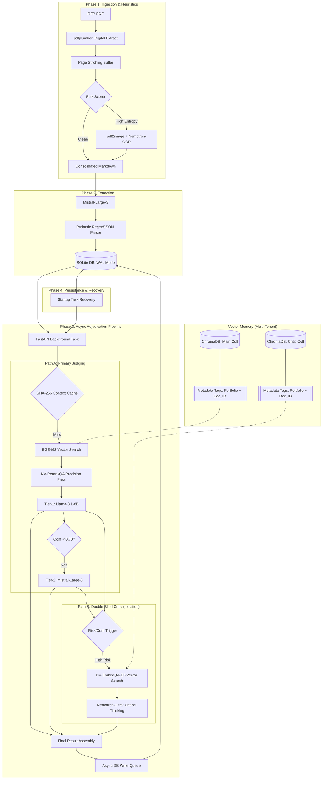

# Architecture Blueprint: Async Double-Blind RAG (V4 - Hard Truths)

# Architecture Blueprint: Async Double-Blind RAG (V5 - Production Local)

This document is the result of a cynical, zero-sugar-coat engineering audit of the **AI Compliance Matrix Architect**, updated to reflect the deliberate choice of a zero-dependency, local-only architecture.

## 🏗️ High-Level Workflow (The "Optimized Local" Reality)

## ⚖️ Deployment Reality (Local Optimization Strategy)

We have deliberately chosen a **"Pure Python"** stack to ensure 100% portability.

### 1. Multi-Tenant Knowledge Portfolios
*   **The Problem**: Mixing data from different industries (e.g. AC vs Laptops) causes RAG hallucinations.
*   **The Fix**: A tiered folder structure (`global/` vs `portfolios/`) and logical `$or` metadata filters in ChromaDB. The AI always pulls Global company truths + ONLY the selected industry's context.

### 2. Project-Aware Chat (RFP Indexing)
*   **The Problem**: Chatbot previously only saw company documents, ignoring the uploaded RFP PDF.
*   **The Fix**: Phase 1 Ingestion now automatically indexes every RFP page into the Vector Store. The Chat engine performs a 3-way join: `Global + Active Portfolio + Current RFP`.

### 3. Scaling: SQLite WAL + Async Queue
*   **The Problem**: SQLite normally locks on concurrent writes.
*   **The Fix**: We use **WAL (Write-Ahead Logging)** mode for better concurrency and a single **Async DB Queue** in the FastAPI process. All background tasks push results to this queue; a dedicated consumer thread writes them to SQLite one by one. This eliminates "Database is Locked" errors while maintaining zero external dependencies.

### 4. Reliability: SQLite Task Recovery
*   **The Problem**: Background tasks disappear if the server crashes.
*   **The Fix**: We store a `task_queue` table in SQLite. On server startup, the system automatically identifies "In Progress" tasks and restarts them.

### 5. Data Integrity: Page Stitching
*   **The Problem**: Requirements split across pages are often lost.
*   **The Fix**: Phase 1 now includes a **Page Stitching Buffer** that overlaps page boundaries (200 tokens) to ensure the LLM sees the end of one page and the start of the next as a single context.

### 4. Security: Dashboard Passkey
*   **The Problem**: UI is open to anyone on the network.
*   **The Fix**: A simple environment-variable-backed **Passkey Gate** is implemented in Streamlit.
