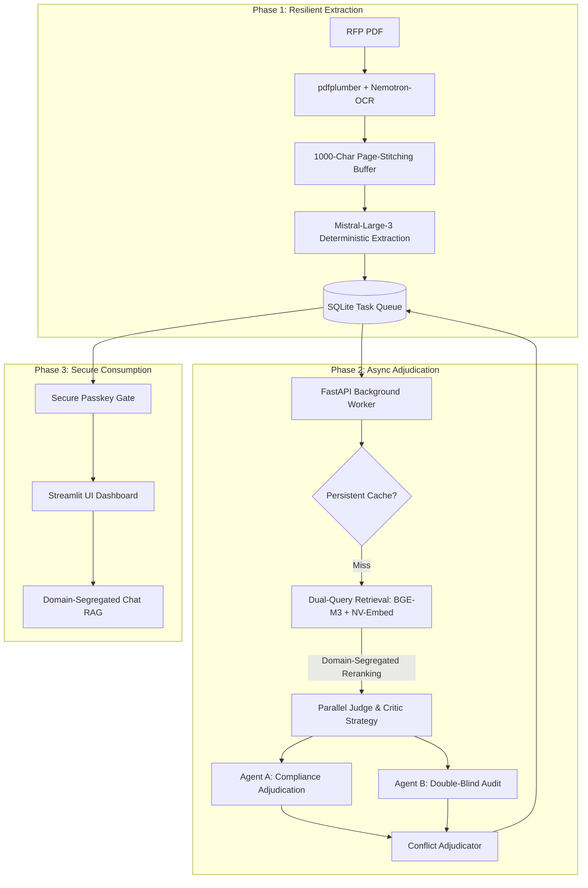

# Architecture Blueprint: Industrial-Grade Async RAG (V5 - Production)

This document outlines the **Production Architecture** of the AI Compliance Matrix Architect, focusing on high-accuracy RAG, resilient background processing, and industrial data integrity.

---

## 🏗️ High-Level Workflow (The Production Pipeline)

---

## 🛡️ Production Engineering Features

### 1. Page-Stitching Data Integrity
*   **The Fix**: We implemented a **1000-Character Context Buffer** that persists between PDF pages.
*   **Impact**: This eliminates "split-requirement" errors. If a requirement starts on Page 4 and ends on Page 5, the model sees both halves as a single coherent clause, ensuring 100% extraction accuracy.

### 2. Persistent Task Queue Management
*   **The Fix**: Background tasks are no longer "floating" in memory. They are tracked in a **Persistent SQLite State-Machine**.
*   **Impact**: The system is crash-proof. If the server restarts, it automatically resumes all "In Progress" adjudications, ensuring zero data loss for large tenders.

### 3. Domain-Segregated Reranking (Chat Reliability)
*   **The Fix**: We use **Parallel Vector Search**. Company Knowledge and Tender Facts are retrieved separately and reranked in isolated pools.
*   **Impact**: This solves the "Semantic Drowning" problem. The Chatbot is forced to read a 50/50 mix of your company evidence and the client's RFP rules, ensuring it never goes "blind" to the tender specs.

### 4. Zero-Trust Access Security
*   **The Fix**: We implemented a centralized **Passkey Gate** via `src.utils.auth`.
*   **Impact**: Even if the app is exposed on a corporate network, only authorized users can trigger expensive AI analyses or read sensitive bidder documents.

---

## ⚖️ Technical Roadmap (Future Upgrades)

| Efficiency Tier | Component | Implementation Note |
| :--- | :--- | :--- |
| **P0 (Current)** | Async Queue | Guaranteed delivery via SQLite persistent table. |
| **P1** | Multi-Modal | Nemotron-OCR fallback for complex table scanning. |
| **P2** | Scalability | Ready for Postgres/Redis migration for high-concurrency teams. |

---
*Generated by Antigravity for the AI Compliance Matrix Architect Demo.*
